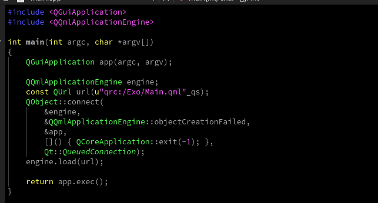

# Introduction à Qt Creator

Qt Creator est un IDE (Integrated Development Environment) multi-plateforme conçu spécialement pour le développement avec les bibliothèques Qt. Il offre un ensemble complet d'outils pour concevoir des interfaces utilisateur, écrire le code, gérer les projets, et bien plus encore.

## Interface Utilisateur de Qt Creator

L'interface utilisateur de Qt Creator est conçue pour faciliter la navigation et l'organisation de vos projets de développement. Voici une vue d'ensemble des composants principaux de l'interface :

### Menu Principal

- **File**: Contient des options pour créer, ouvrir, enregistrer et gérer vos fichiers et projets.
- **Edit**: Permet de modifier votre code avec des fonctionnalités comme le copier-coller, le refactoring, et la recherche/remplacement.
- **View**: Personnalise l'affichage de Qt Creator, y compris les barres d'outils et les fenêtres de dock.
- **Build**: Compile votre projet et exécute les outils de construction.
- **Debug**: Lance le débogueur et configure les points d'arrêt.
- **Analyze**: Outils d'analyse de code pour améliorer la performance et la qualité du code.
- **Tools**: Accès à des outils supplémentaires comme le gestionnaire de versions.
- **Window**: Gère les fenêtres et les vues de l'IDE.
- **Help**: Fournit de l'aide et des documents de référence sur Qt Creator.

### Barre Latérale

- **Projects**: Liste tous vos projets actuellement ouverts et leurs fichiers respectifs.
- **Edit**: Accède à l'éditeur de code.
- **Design**: Permet de concevoir visuellement les interfaces utilisateur avec Qt Designer.
- **Debug**: Affiche les outils et les informations nécessaires pour le débogage.
- **Help**: Affiche la documentation et les aides.

### Zone Centrale

- **Editeur de Code**: La grande fenêtre au centre est l'éditeur de code où vous écrivez et modifiez votre code.

### Barre d'État

- **Issues**: Affiche les problèmes de compilation et les avertissements.
- **Application Output**: Sortie de votre application lors de son exécution.
- **Compile Output**: Résultats de la compilation de votre projet.
- **Terminal**: Un terminal intégré pour exécuter des commandes shell.
- **Version Control**: Messages du système de contrôle de version.
- **General Messages**: Informations générales et messages d'état.

## Conclusion

Qt Creator est un outil puissant qui simplifie le processus de développement avec Qt. En vous familiarisant avec son interface, vous serez en mesure de créer des applications impressionnantes pour une grande variété de plateformes.

---

---

Parfait, allons-y pas à pas pour expliquer le processus de création d'un projet Qt pour Android et Desktop dans Qt Creator, en utilisant les images que vous avez fournies.

---

# Création d'un Nouveau Projet Qt

## Étape 1: Démarrage et Sélection du Template

Lorsque vous créez un nouveau projet dans Qt Creator, vous commencez par sélectionner un modèle de projet. Les modèles sont des points de départ pré-configurés qui vous aident à démarrer avec une certaine structure de projet.

- **Qt Widgets Application**: Pour les applications basées sur des widgets, qui utilisent des éléments d'interface traditionnels.
- **Qt Console Application**: Pour une application de ligne de commande.
- **Qt Quick Application**: Pour les applications modernes et fluides utilisant QML.

Pour une application qui cible à la fois Android et Desktop, sélectionnez **Qt Quick Application**.

## Étape 2: Définition de l'Emplacement du Projet

Ensuite, vous devez spécifier où le projet sera enregistré sur votre système de fichiers. Il est important de choisir un emplacement qui vous aidera à organiser et à retrouver facilement votre projet plus tard.

- **Name**: Nom de votre projet.
- **Create in**: L'emplacement sur votre disque où le projet sera enregistré.

## Étape 3: Détails du Projet

Ici, vous pouvez choisir des options supplémentaires pour votre projet.

- **Creates a project that you can open in Qt Design Studio**: Si vous utilisez Qt Design Studio pour concevoir l'interface utilisateur, cochez cette case.
- **Use Qt Virtual Keyboard**: Si vous voulez inclure le clavier virtuel de Qt, utile pour les dispositifs tactiles.
- **The minimum version of Qt**: Sélectionnez la version minimale de Qt que vous souhaitez utiliser pour votre application.

## Étape 4: Sélection des Kits

Les kits sont des ensembles d'outils et de configurations qui permettent à Qt Creator de construire et de déployer des applications pour différentes plateformes et architectures.

- Pour Android, sélectionnez les kits correspondants à l'architecture du processeur de votre cible (armeabi-v7a, arm64-v8a, x86, etc.).
- Pour Desktop, sélectionnez le kit correspondant à votre système d'exploitation et à votre compilateur (par exemple, GCC 64bit pour Linux).

## Étape 5: Gestion de Projet

- **Add as a subproject to**: Si vous travaillez dans un grand projet et que celui-ci doit être une partie d'un projet existant, sélectionnez-le ici.
- **Add to version control**: Choisissez "Git" pour initialiser un dépôt Git avec votre projet. C'est crucial pour le suivi des versions de votre code et pour travailler en équipe. Git garde une trace de toutes les modifications et vous permet de revenir à des versions antérieures si nécessaire.

Finalement, vérifiez la liste des fichiers qui seront créés et cliquez sur **Finish** pour créer le projet.

### Mon projet

Finalement, voici le projet : Exo que j'ai créé

En bas, à gauche, de bas vers le haut, vous retrouverez des boutons, le bouton en triangle vert est celui vous permettant d'executer le projet.

Nous avions sélectionné plusieurs kits, au dessus du boutton d'execution se trouve le bouton de gestion des kits.

Donc comme vous pouvez le remarquer actuellement je travail avec le kit pour application Desktop (pour PC), pour passer à la version pour android, vous cliquez sur le bouton et on sélectionne une version pour android.

### Executer pour android.

Connectez votre telephone android au PC. et activer le partage de fichier. Sélectionner un des kits android. Et dans la fenettre des kits, en haut, Il y a un bouton **Run Device/Executer appareil** Cliquez dessus pour sélectionner votre téléphone. Patienter que le bouton des kits passe au vert et **Executer le projet**

Si vous rencontrez ce message d'erreur, appuiyez sur **Oui/Yes**

Si vous rencontrez une erreur du genre l'architecture de votre téléphone n'est pas supportée, changer de kit, au mois l'un des 4 kits fonctionnera pour votre téléphone. 

## Changer le nom de l'application

Si vous observez bien, le nom de l'application est le ,om de votre projet précédé de **app**. Nous allons corriger cela.

Chenger le contenu ci-dessus de votre projet, par le contenu de celui ci-dessous
Grace aux éléments des menus de gauche, vous savez que vous etes dans le fichier **Main.qml** ou **main.qml** pour d'autres.

> Pour changer le nom du projet, rendez-vous dans le fichier **CMakeLIsts.txt**

Voici son contenu : 

### Nos modifications:

|Les appExo par : |
|---|
|Votre projet a pour nom par example Exo, main le nom de l'application est **appExo**|
|Localiser la ligne **project(Exo VERSION 0.1 LANGUAGES CXX)**: dans la parentèse, vous retrouvez en premier le nom de votre projet|
|Localiser la ligne **qt_add_executable()**: Remplacer le premier élément de la parenthèse par le nom du projet (Exo, dans mon cas).|
|Maintenant, remplacer tout les autres nom commencant par app (appExo dans mon cas) par ceci : **${PROJECT_NAME}**|
|dans **qt_add_qml_module** vous remarquerer qu'il y a un **URI** suivi du nom du projet: Remplacer le nom par autre chose. Par exemple chez moi, c'était **Exo**, j'ai changé par **ExoURI**|
|Effacer les lignes suivantes : **QML_FILES Main.qml** |

> Remplacer par : 

    NO_RESOURCE_TARGET_PATH
    IMPORTS
    QtQuick
    IMPORT_PATH
    ${PROJECT_BINARY_DIR}
    QML_FILES
        ${QML_SOURCES}        

Juste avant la ligne **qt_add_qml_module** , ajouter ceci : 

    file(GLOB_RECURSE QML_SOURCES RELATIVE ${CMAKE_CURRENT_SOURCE_DIR} ${CMAKE_CURRENT_SOURCE_DIR}/*.qml)

> Parfait, nous avons terminé :

### Voici le résultat théorique : 

    qt_add_executable(le_nom_du_projet
        main.cpp
    )

    file(GLOB_RECURSE QML_SOURCES RELATIVE ${CMAKE_CURRENT_SOURCE_DIR} ${CMAKE_CURRENT_SOURCE_DIR}/*.qml)
    qt_add_qml_module(${PROJECT_NAME}
        URI le_nouveau_nom_pour_URI
        VERSION 1.0
        NO_RESOURCE_TARGET_PATH
        IMPORTS
        QtQuick
        IMPORT_PATH
        ${PROJECT_BINARY_DIR}
        QML_FILES
            ${QML_SOURCES}
    )

### Voici le résultat chez moi : 

    qt_add_executable(Exo
        main.cpp
    )

    file(GLOB_RECURSE QML_SOURCES RELATIVE ${CMAKE_CURRENT_SOURCE_DIR} ${CMAKE_CURRENT_SOURCE_DIR}/*.qml)
    qt_add_qml_module(${PROJECT_NAME}
        URI ExoURI
        VERSION 1.0
        NO_RESOURCE_TARGET_PATH
        IMPORTS
        QtQuick
        IMPORT_PATH
        ${PROJECT_BINARY_DIR}
        QML_FILES
            ${QML_SOURCES}
    )

### Rendez-vous dans le main.cpp situé dans Source Files

Localiser la ligne suivante : **const QUrl url(u"qrc:/Exo/Main.qml"_qs);**

Juste apres le **qrc:** retirer : **/Exo**, c'est à dire **/Le_Nom_De_Votre_Projet**. 

VOus aurez donc comme résultat : **const QUrl url(u"qrc:/Main.qml"_qs);**

### Le plus délicat

Allez sur le menu project : 

Une fois dedans, vous verrez la liste des kits disponibles, pour les kits que vous utilisez, vous verrez : deux sous menus **build** et **run**
Faites un click droit sur le nom du kit, (là ou il y a icone de téléphone) et appuiyez sur **Disable kit...*** ou **Désactiver kit ...***

Faites en de meme pour les autres kits que vous aviez sélectionné. Une fois que c'est fait, revenez et double cliquer sur les kits , ainsi vous les réactiverez.

<video controls>
    <source src="lien_de_la_video.mp4" type="video/mp4">
    Votre navigateur ne supporte pas la lecture de vidéo.
</video>

Executer à nouveau le projet. Vous remarquerez que le projet marche et que le nom a bien changé. Pour le moment, n'essayez pas de trop comprendre ce qui a été fait. Mais sachez que nous avons fait des configurations pour le long terme, et nous nous éparghons des problèmes plus tard.