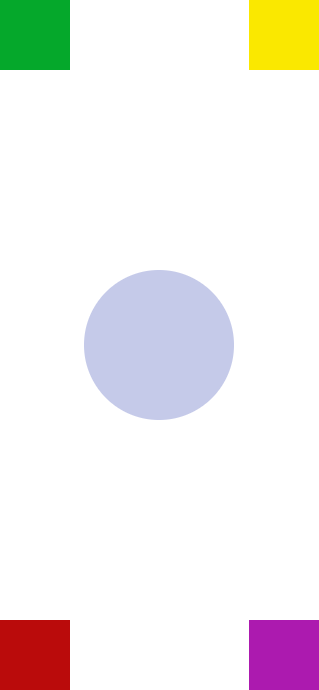

# Introduction à QML pour Débutants

Bienvenue dans ce tutoriel d'introduction à QML, le langage de description d'interface utilisateur de Qt. QML est un langage puissant qui permet de créer des interfaces utilisateurs réactives et attractives pour vos applications. Ce tutoriel couvrira les bases de QML, y compris la création de rectangles, le positionnement des éléments et la manipulation des propriétés.

## Qu'est-ce que QML ?

QML (Qt Modeling Language) est un langage déclaratif qui permet de définir des interfaces utilisateur pour des applications programmées avec Qt. QML utilise un système de composants avec un fort accent sur une syntaxe concise et claire, ce qui le rend idéal pour les débutants.

## Commencer avec QML

Pour commencer, assurez-vous d'avoir installé Qt Creator et configuré un projet Qt Quick comme décrit dans notre précédent tutoriel.

## Les Rectangles

Le rectangle est l'un des éléments les plus basiques en QML et sert souvent de conteneur pour d'autres éléments.

### Code minimal

```qml

import QtQuick
import QtQuick.Controls
import QtQuick.Window

ApplicationWindow {
    width: 640
    height: 480
    visible: true
    title: qsTr("Hello World")
}
```

### Création d'un Rectangle Simple

```qml
import QtQuick
import QtQuick.Controls
import QtQuick.Window

ApplicationWindow {
    width: 640
    height: 480
    visible: true
    title: qsTr("Hello World")

    Rectangle {
        id: rectangle1
        width: 100
        height: 100
        color: "red"
    }
}
```

Dans cet exemple, nous avons créé une fenêtre avec un rectangle rouge.

## Propriétés

Les propriétés en QML définissent les caractéristiques des éléments. Par exemple, `color`, `width`, et `height` sont des propriétés de `Rectangle`.

### Changement de Couleur

Pour changer la couleur d'un rectangle, ajustez la propriété `color`.

```qml
Rectangle {
    color: "blue"
}
```

## Positionnement

Le positionnement en QML peut être géré de plusieurs façons. Les plus simples sont les propriétés `x` et `y`.

### Positionnement Absolu

```qml
Rectangle {
    x: 50
    y: 50
    // ...
}
```

Ceci place le rectangle à 50 pixels du bord gauche (`x: 50`) et 50 pixels du bord supérieur (`y: 50`) de son parent.


# Le Positionnement avec les Anchors en QML

## Introduction aux Anchors

Les ancres (`anchors`) sont un moyen puissant et flexible de positionner les éléments dans QML. Elles permettent de définir la position d'un élément par rapport à un autre ou par rapport à son parent, facilitant ainsi la création de mises en page réactives.

## Concept de Base des Anchors

Un `anchor` relie un côté d'un élément à un côté d'un autre élément. Par exemple, vous pouvez ancrer le côté gauche d'un rectangle (l'élément enfant) au côté gauche de la fenêtre (l'élément parent).

### Types d'Anchors

- `anchors.left`: le côté gauche de l'élément.
- `anchors.right`: le côté droit de l'élément.
- `anchors.top`: le haut de l'élément.
- `anchors.bottom`: le bas de l'élément.
- `anchors.horizontalCenter`: le centre horizontal de l'élément.
- `anchors.verticalCenter`: le centre vertical de l'élément.
- `anchors.fill`: fait en sorte que l'élément enfant remplisse entièrement l'élément parent.
- `anchors.centerIn`: centre l'élément enfant dans l'élément parent.

## Exemple Simple d'Anchors

```qml
import QtQuick
import QtQuick.Controls
import QtQuick.Window

ApplicationWindow {
    visible: true
    width: 640
    height: 480
    title: "Anchor Tutorial"

    Rectangle {
        id: redRect
        width: 200
        height: 200
        color: "red"
        anchors.centerIn: parent
    }

    Rectangle {
        id: blueRect
        width: 100
        height: 100
        color: "blue"
        anchors.top: redRect.bottom
        anchors.horizontalCenter: redRect.horizontalCenter
    }
}
```

Dans cet exemple, `redRect` est centré dans la fenêtre grâce à `anchors.centerIn: parent`. Ensuite, `blueRect` est positionné juste en dessous de `redRect` en utilisant `anchors.top: redRect.bottom` et centré horizontalement par rapport à `redRect` avec `anchors.horizontalCenter: redRect.horizontalCenter`.

## Positionnement Relatif avec Marges

Vous pouvez également spécifier une marge lors de l'utilisation des ancres pour contrôler l'espacement entre les éléments.

```qml
Rectangle {
    anchors.left: parent.left
    anchors.leftMargin: 10 // Espace de 10 pixels depuis le côté gauche du parent
}
```


## Restrictions des Anchors

- Un élément ne peut pas avoir à la fois une ancre et une propriété de position (comme `x` ou `y`) sur le même axe.
- Vous ne pouvez pas ancrer les côtés opposés d'un élément à plus d'un élément. Par exemple, `left` et `right` ne peuvent pas être ancrés à des éléments différents.

## Un example

Réalison la vu suivante



> Très très très important

- Un carré est un rectangle dont la longueur est égale à la lageur
- Un cercle est un carré dont les courbures sont grands devant les dimensions
- Pour une courbure (aux sommets), on utilise la propriété `radius`

Voici le code qui permet d'avoir le résultat

```qml
import QtQuick
import QtQuick.Controls
import QtQuick.Window

ApplicationWindow {
    width: 319
    height: 690
    visible: true
    title: qsTr("Hello World")

    Rectangle {
        id: rect_1
        width: 70
        height: 70
        color: "green"
        anchors.left: parent.left
        anchors.top: parent.top
    }

    Rectangle {
        id: rect_2
        width: 70
        height: 70
        color: "yellow"
        anchors.right: parent.right
        anchors.top: parent.top
    }

    Rectangle {
        id: rect_3
        width: 70
        height: 70
        color: "red"
        anchors.left: parent.left
        anchors.bottom: parent.bottom
    }

    Rectangle {
        id: rect_4
        width: 70
        height: 70
        color: "blue"
        anchors.right: parent.right
        anchors.bottom: parent.bottom
    }

    Rectangle {
        id: rect_5
        width: 150
        height: 150
        color: "lightblue"
        anchors.centerIn: parent
        radius: 500
    }
}

```

---

Regardons ce code QML et expliquons ce qui se passe étape par étape pour obtenir le résultat montré dans l'image.

```qml
import QtQuick
import QtQuick.Controls
import QtQuick.Window

ApplicationWindow {
    width: 319
    height: 690
    visible: true
    title: qsTr("Hello World")
```
Ces premières lignes importent les modules nécessaires et définissent une fenêtre d'application avec une largeur de 319 pixels et une hauteur de 690 pixels. La fenêtre est rendue visible et porte le titre "Hello World".

```qml
    Rectangle {
        id: rect_1
        width: 70
        height: 70
        color: "green"
        anchors.left: parent.left
        anchors.top: parent.top
    }
```
Ce rectangle est le premier élément graphique défini dans la fenêtre. Avec une largeur et une hauteur de 70 pixels et une couleur verte, il est ancré en haut à gauche de la fenêtre (`parent`).

```qml
    Rectangle {
        id: rect_2
        width: 70
        height: 70
        color: "yellow"
        anchors.right: parent.right
        anchors.top: parent.top
    }
```
Le deuxième rectangle est identique au premier en termes de taille, mais il est jaune et ancré en haut à droite de la fenêtre.

```qml
    Rectangle {
        id: rect_3
        width: 70
        height: 70
        color: "red"
        anchors.left: parent.left
        anchors.bottom: parent.bottom
    }
```
Le troisième rectangle est rouge et ancré en bas à gauche de la fenêtre.

```qml
    Rectangle {
        id: rect_4
        width: 70
        height: 70
        color: "blue"
        anchors.right: parent.right
        anchors.bottom: parent.bottom
    }
```
Le quatrième rectangle est bleu, de la même taille que les précédents, et ancré en bas à droite de la fenêtre.

```qml
    Rectangle {
        id: rect_5
        width: 150
        height: 150
        color: "lightblue"
        anchors.centerIn: parent
        radius: 500
    }
}
```
Le dernier rectangle est en fait un cercle, en raison de son rayon très élevé (500, bien plus grand que la moitié de sa hauteur ou de sa largeur, ce qui lui donne une forme de cercle parfait). Il est de couleur bleu clair, plus grand que les autres (150x150 pixels) et est centré dans la fenêtre.

### Explication du `radius`

Dans QML, le `radius` d'un rectangle arrondit ses coins. Si le `radius` est égal à la moitié de la hauteur ou de la largeur, le rectangle prendra la forme d'un cercle. Ici, le `radius` est délibérément fixé à un nombre beaucoup plus élevé que nécessaire pour créer un cercle, garantissant ainsi que peu importe la taille du rectangle, les coins seront complètement arrondis et l'élément apparaîtra comme un cercle.

### Conclusion

Chaque rectangle est positionné de manière spécifique à l'intérieur de l'`ApplicationWindow` en utilisant les propriétés `anchors`, qui définissent les relations de position relative entre les éléments graphiques. Le cercle central est positionné de manière à être centré par rapport à la fenêtre, fournissant un point focal au milieu des rectangles colorés positionnés aux coins.

### Comment mettre une marge entre les rectangles et les bords de la fenettre

```qml
import QtQuick
import QtQuick.Controls
import QtQuick.Window

ApplicationWindow {
    width: 319
    height: 690
    visible: true
    title: qsTr("Hello World")

    Rectangle {
        id: rect_1
        width: 70
        height: 70
        color: "green"
        anchors.left: parent.left
        anchors.top: parent.top

        anchors.topMargin: 8
        anchors.leftMargin: 8
    }

    Rectangle {
        id: rect_2
        width: 70
        height: 70
        color: "yellow"
        anchors.right: parent.right
        anchors.top: parent.top

        anchors.topMargin: 8
        anchors.rightMargin: 8
    }

    Rectangle {
        id: rect_3
        width: 70
        height: 70
        color: "red"
        anchors.left: parent.left
        anchors.bottom: parent.bottom

        anchors.leftMargin: 8
        anchors.bottomMargin: 8
    }

    Rectangle {
        id: rect_4
        width: 70
        height: 70
        color: "blue"
        anchors.right: parent.right
        anchors.bottom: parent.bottom

        anchors.rightMargin: 8
        anchors.bottomMargin: 8
    }

    Rectangle {
        id: rect_5
        width: 150
        height: 150
        color: "lightblue"
        anchors.centerIn: parent
        radius: 500
    }
}

```
## Quelques exercices :


