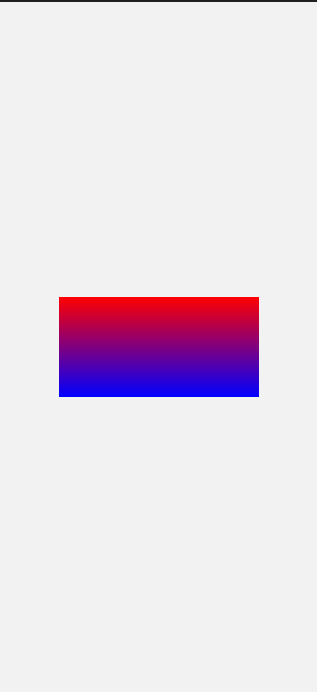
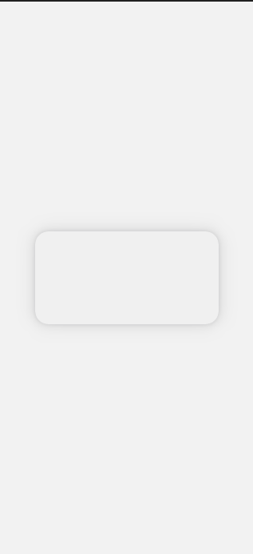
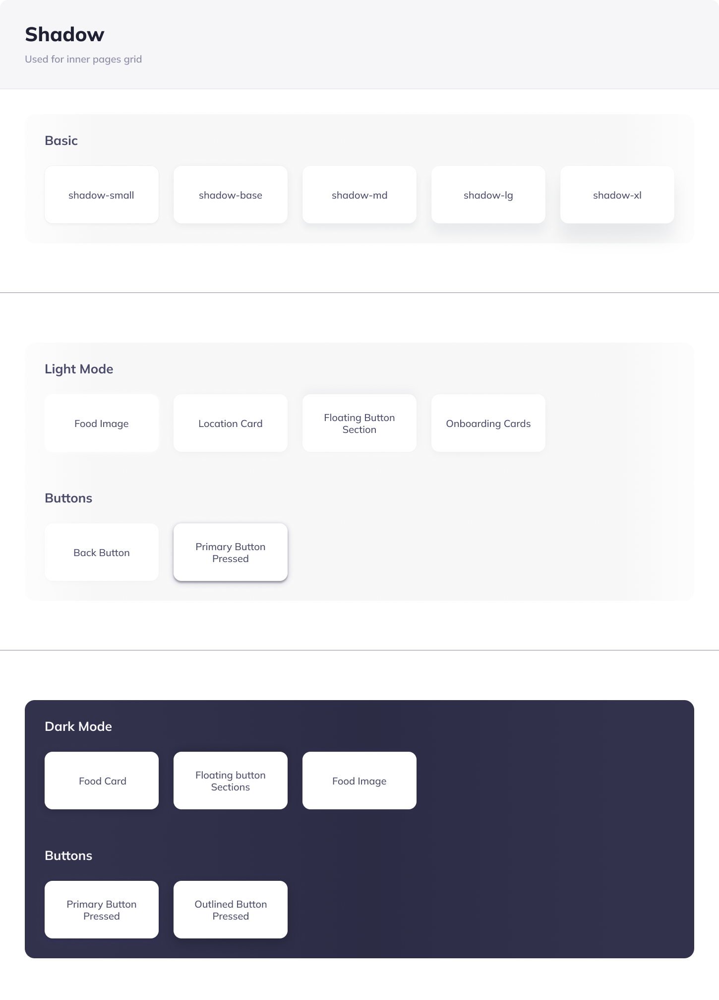

Les gradients permettent de créer des transitions fluides entre deux ou plusieurs couleurs spécifiées. En QML, vous pouvez utiliser l'élément `Gradient` dans un `Rectangle`, un `Path`, ou tout autre élément dessinable pour créer de beaux effets visuels. Voici comment vous pouvez les utiliser :

# Tutoriel sur l'Utilisation des Gradients en QML

## Introduction aux Gradients

Les gradients sont souvent utilisés dans les interfaces utilisateur pour ajouter de la profondeur, du volume ou simplement pour améliorer l'esthétique.

## Types de Gradients

En QML, il existe principalement deux types de gradients :

1. **Gradient Linéaire :** Transition d'une couleur à une autre le long d'une ligne.
2. **Gradient Radial :** Transition d'une couleur à une autre à partir d'un point central vers l'extérieur.

## Création d'un Gradient Linéaire

Voici comment créer un gradient linéaire :

```qml
import QtQuick
import QtQuick.Controls
import QtQuick.Window

ApplicationWindow {
    width: 319
    height: 690
    visible: true
    title: qsTr("Hello World")

    Rectangle {
        width: 200; height: 100
        anchors.centerIn: parent
        gradient: Gradient {
            GradientStop { position: 0.0; color: 'red' }
            GradientStop { position: 1.0; color: 'blue' }
        }
    }
}
```



Dans cet exemple, `GradientStop` est utilisé pour définir les couleurs aux différentes positions du gradient. La `position` est un nombre compris entre `0.0` (début du gradient) et `1.0` (fin du gradient).

## Utilisation des Gradients

Les gradients peuvent être utilisés pour styliser de nombreux éléments QML différents, tels que les boutons, les barres de progression, les fonds d'écran, et bien plus encore.

## Personnalisation des Gradients

Vous pouvez également ajuster l'opacité et les couleurs des `GradientStop` pour obtenir l'effet visuel souhaité. De plus, vous pouvez combiner plusieurs `GradientStop` avec différentes positions et couleurs pour créer des transitions de couleurs plus complexes.

## Conclusion

Les gradients sont un outil puissant pour ajouter de la couleur et de la vie à vos interfaces QML. En expérimentant avec différentes positions, couleurs et types de gradients, vous pouvez créer une variété d'effets visuels attrayants pour vos applications.

# Les ombrages en QML

## Introduction

Avec la version Qt 6.6, l'élément `MultiEffect` a été introduit dans `QtQuick.Effects` pour fournir un moyen d'appliquer des ombres et d'autres effets visuels directement sur les éléments sans utiliser `QtGraphicalEffects`.

## Création d'une Ombre de Base

Pour ajouter une ombre à un élément, vous pouvez utiliser l'élément `MultiEffect` comme suit :

```qml
import QtQuick
import QtQuick.Controls
import QtQuick.Window
import QtQuick.Effects

ApplicationWindow {
    width: 319
    height: 690
    visible: true
    title: qsTr("Hello World")
    
    
    Rectangle {
        id: rect_1
        width: 230; height: 116
        anchors.centerIn: parent
        radius: 16
        color: "#F0F0F0" // Ajoutez une couleur pour mieux visualiser l'effet
    }
    
    MultiEffect {
        source: rect_1
        anchors.fill: rect_1
        
        shadowColor: "#0C1A4B" // Ombre semi-transparente de couleur noire
        shadowOpacity: 0.24
        shadowBlur: 1
        shadowEnabled: true
        shadowVerticalOffset: 0
        shadowHorizontalOffset: 0
    }
}

```


Ici, `MultiEffect` est appliqué à `rect_1`. Nous configurons des propriétés telles que `shadowColor`, `shadowOpacity`, `shadowBlur`, `shadowEnabled`, `shadowVerticalOffset`, et `shadowHorizontalOffset` pour définir l'apparence de l'ombre.

## Explication des Propriétés d'Ombre

- `shadowColor`: La couleur de l'ombre.
- `shadowOpacity`: L'opacité de l'ombre. Plus la valeur est proche de 1, plus l'ombre est opaque.
- `shadowBlur`: La quantité de flou de l'ombre. Une valeur plus élevée rendra l'ombre plus diffuse.
- `shadowVerticalOffset` et `shadowHorizontalOffset`: Ces valeurs décalent l'ombre verticalement et horizontalement par rapport à l'élément.


## Ajouter Plusieurs Ombres

Vous pouvez ajouter plusieurs effets d'ombre à un élément en utilisant plusieurs `MultiEffect`, chacun configuré différemment :

```qml
MultiEffect {
    // ... Configuration du premier effet d'ombre
}

MultiEffect {
    // ... Configuration du deuxième effet d'ombre
}
```

## Conclusion

En utilisant `MultiEffect` de QtQuick.Effects, vous pouvez ajouter des ombres attrayantes et des effets visuels à vos éléments QML. Expérimentez avec différentes couleurs, opacités et décalages pour obtenir l'effet d'ombre souhaité et pour donner à vos interfaces utilisateur un aspect plus profond et plus poli.

## Quelques exercices


Voici un exercice pour créer quatre rectangles avec différents styles d'ombres en QML en utilisant `MultiEffect` de `QtQuick.Effects`. Chaque rectangle aura des propriétés spécifiques de positionnement, de taille et d'ombre.

## Exercice : Créer des Rectangles avec Différents Styles d'Ombres en QML

Vous allez créer quatre rectangles (`Rectangle`) avec des ombres (`MultiEffect`) spécifiques. 

### Instructions Générales pour Chaque Rectangle :

- **Taille :** Largeur de 230 pixels et hauteur de 116 pixels.
- **Couleur de Fond :** Blanc (`#FFFFFF`).
- **Bord Arrondi :** Rayon de 16 pixels (`radius`).

### Styles d'Ombres Spécifiques :

1. **Ombre de Base :**
   - Ombre :
     - Décalage horizontal (`shadowHorizontalOffset`): 0px
     - Décalage vertical (`shadowVerticalOffset`): 4px
     - Flou (`shadowBlur`): 20px
     - Couleur (`shadowColor`): #323247
     - Opacité (`shadowOpacity`): 0.08

2. **Ombre Moyenne :**
   - Ombre :
     - Décalage horizontal : 0px
     - Décalage vertical : 10px
     - Flou : 16px
     - Couleur : #14253f
     - Opacité : 0.06

3. **Ombre Extra Large :**
   - Ombre :
     - Décalage horizontal : 0px
     - Décalage vertical : 30px
     - Flou : 40px
     - Couleur : #14253f
     - Opacité : 0.08

4. **Ombre Primaire Pressée :**
   - Ombre :
     - Multiples ombres superposées pour simuler les trois ombres en CSS :
       - Première Ombre :
         - Décalage horizontal : 0px
         - Décalage vertical : 4px
         - Flou : 4px
         - Couleur : #000000
         - Opacité : 0.25
       - Deuxième Ombre :
         - Décalage horizontal : 0px
         - Décalage vertical : 1px
         - Flou : 8px
         - Couleur : #8981ae
         - Opacité : 0.3
       - Troisième Ombre :
         - Décalage horizontal : 0px
         - Décalage vertical : 4px
         - Flou : 15px
         - Couleur : #3a2d78
         - Opacité : 0.2
### Consignes :

- Pour chaque rectangle, utilisez l'élément `MultiEffect` pour ajouter l'effet d'ombre.
- Ajustez l'opacité et la couleur des ombres pour correspondre aux valeurs RGBA fournies.
- Positionnez chaque rectangle

### Remarques :
- L'opacité de l'ombre en QML est définie par la composante alpha de la couleur `shadowColor`.

### Résultat Attendu :


