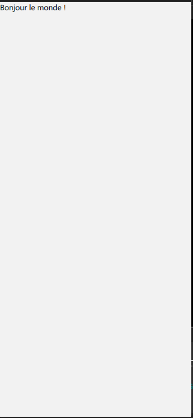
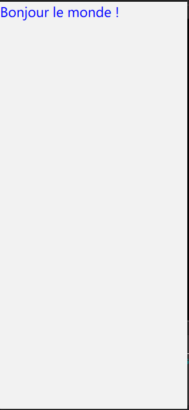
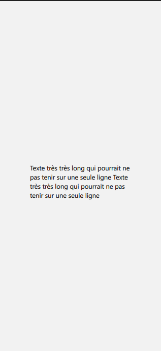
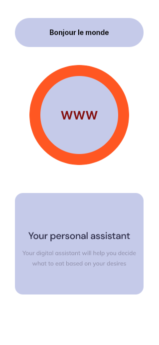

# Tutoriel sur l'utilisation des Textes en QML

QML (Qt Modeling Language) est un langage déclaratif qui permet de créer des interfaces utilisateur élégantes et réactives. Une partie fondamentale de toute interface utilisateur est le texte, que vous pouvez manipuler de manière très détaillée en QML. Ce tutoriel vous montrera comment utiliser l'élément `Text` pour afficher et formater du texte.

## Affichage de Texte Basique

Pour commencer avec le texte en QML, vous utilisez l'élément `Text`.

```qml
import QtQuick
import QtQuick.Controls
import QtQuick.Window

ApplicationWindow {
    width: 319
    height: 690
    visible: true
    title: qsTr("Hello World")

    Item {
        width: 200
        height: 50

        Text {
            text: "Bonjour le monde !"
            color: "black"
        }
    }
}
```

<p align="center">
  
</p>


Dans cet exemple, nous avons un `Item` qui contient un élément `Text`. L'élément `Text` a une propriété `text` qui est la chaîne de caractères à afficher et une propriété `color` qui définit la couleur du texte.


En QML, `Item` est l'élément de base pour les objets visuels. Il est souvent utilisé comme conteneur pour d'autres éléments QML, et voici pourquoi :

## Fondamentaux de `Item`

- **Conteneur :** `Item` peut contenir d'autres éléments. Cela signifie que vous pouvez l'utiliser pour grouper des éléments et contrôler leur organisation spatiale.
- **Propriétés de position et de dimension :** Il possède des propriétés telles que `x`, `y`, `width` et `height` qui permettent de déterminer où et comment il (et par extension, ses enfants) doit être affiché.
- **Ancrage :** Il supporte le système d'ancrage de QML, ce qui signifie que vous pouvez ancrer ses enfants à lui-même ou entre eux.
- **Invisible par lui-même :** Par défaut, un `Item` est invisible ; il n'a pas de représentation visuelle autre que celle de ses enfants.

## Comment ça fonctionne ?

Vous pouvez considérer `Item` comme une boîte invisible dans laquelle vous pouvez placer d'autres éléments. Il n'affiche rien par lui-même, mais il définit l'espace de coordonnées pour ses éléments enfants. Les éléments enfants héritent et peuvent être positionnés par rapport à cet espace.


## Propriétés et Méthodes Importantes

- **parent :** Référence à l'élément parent.
- **children :** Une liste des éléments enfants.
- **anchors :** Permet de définir la position relative aux autres éléments.
- **visible :** Détermine si l'élément est rendu ou non. Par défaut, cette propriété est `true`, mais un `Item` sans contenu visuel ou sans enfants visibles ne sera pas rendu.
- **onWidthChanged, onHeightChanged :** Ce sont des événements qui peuvent être utilisés pour exécuter du code lorsque la largeur ou la hauteur de l'élément change.

L'`Item` est fondamental dans la hiérarchie des éléments QML et sert souvent de point de départ pour la création d'éléments personnalisés.

## Propriétés de Texte

Vous pouvez personnaliser votre texte de nombreuses façons en utilisant différentes propriétés.

### Couleur et Taille

Changez la couleur et la taille du texte comme ceci :

```qml
Text {
    text: "Bonjour le monde !"
    color: "blue"
    font.pixelSize: 24
}
```



La propriété `font.pixelSize` définit la taille du texte en pixels.

### Police et Style

Définissez la police et le style du texte ainsi :

```qml
Item {
        width: 200
        height: 50

        anchors.centerIn: parent

        Text {
            text: "Texte en gras et italique"
            font.family: "Helvetica"
            font.pixelSize: 18
            font.bold: true
            font.italic: true
        }
    }
```


Les propriétés `font.family`, `font.bold` et `font.italic` permettent de choisir la famille de police, de mettre en gras et en italique, respectivement.

### Alignement et Débordement

Prenons l'exemple suivant où je veux afficher le texte suivant : "Texte très très long qui pourrait ne pas tenir sur une seule ligne Texte très très long qui pourrait ne pas tenir sur une seule ligne"

```qml
Text {
    text: "Texte très très long qui pourrait ne pas tenir sur une seule ligne Texte très très long qui pourrait ne pas tenir sur une seule ligne"
    width: 200
}
```

Voici le résultat : 


L'alignement et la gestion du débordement du texte sont configurés de la manière suivante :

```qml
Text {
    text: "Texte très très long qui pourrait ne pas tenir sur une seule ligne Texte très très long qui pourrait ne pas tenir sur une seule ligne"
    width: 200
    wrapMode: Text.Wrap
    horizontalAlignment: Text.AlignLeft
    verticalAlignment: Text.AlignTop
}
```


Ici, `wrapMode: Text.Wrap` permet au texte de passer à la ligne suivante s'il dépasse la largeur définie. `horizontalAlignment` et `verticalAlignment` contrôlent l'alignement du texte à l'intérieur de son conteneur.

<p align="center">
  
</p>

## Conclusion

Cet aperçu montre comment afficher et formater du texte en QML. Les éléments de texte peuvent être très simples ou extrêmement personnalisés, avec un contrôle précis sur la police, la taille, la couleur, l'alignement, et bien plus. Expérimentez avec les différentes propriétés pour voir comment vous pouvez intégrer le texte de manière créative dans vos applications QML.


## Quelques exercices :

Réaliser en Qml ce qui suit

