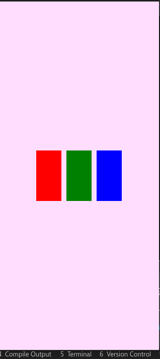
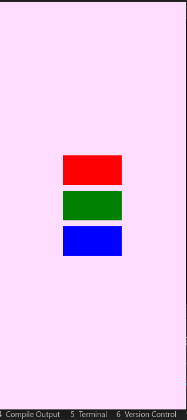
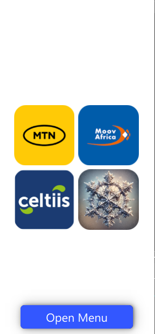
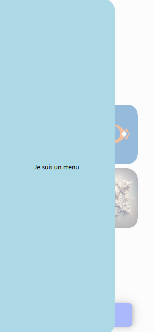
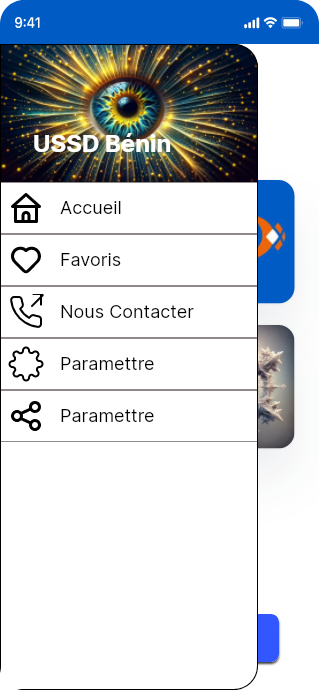

# Tutoriel QML : Comprendre les Layouts - Column, Row, et Grid

## Introduction

Dans QML, les layouts sont des composants qui organisent les éléments enfants de manière structurée et réactive. Nous allons explorer trois types de layouts : `Column`, `Row`, et `Grid`.

## 1. Column Layout

`Column` arrange ses éléments enfants verticalement.

### Exemple :




```qml
import QtQuick
import QtQuick.Controls
import QtQuick.Window
import QtQuick.Effects

ApplicationWindow {
    width: 319
    height: 690
    visible: true
    title: qsTr("Hello World")

    color: "#ffddff"
    Column {
        spacing: 10 // Espace entre les éléments
        anchors.centerIn: parent
        Rectangle {
            width: 100; height: 50; color: "red"
        }
        Rectangle {
            width: 100; height: 50; color: "green"
        }
        Rectangle {
            width: 100; height: 50; color: "blue"
        }
    }

}

```

### Explication :

- `Column` aligne tous les `Rectangle` l'un sous l'autre.
- `spacing` définit l'espace entre chaque élément.

## 2. Row Layout

`Row` arrange ses éléments enfants horizontalement.

### Exemple :




```qml
Row {
    spacing: 10 // Espace entre les éléments
    anchors.centerIn: parent


    Rectangle { width: 50; height: 100; color: "red" }
    Rectangle { width: 50; height: 100; color: "green" }
    Rectangle { width: 50; height: 100; color: "blue" }
}
```

### Explication :

- `Row` aligne tous les `Rectangle` côte à côte.
- `spacing` sert également à espacer les éléments.

## 3. Grid Layout

`Grid` arrange ses éléments enfants en grille.

### Exemple :


```qml
    Grid {
        rows: 2
        columns: 2
        spacing: 10
        
        anchors.centerIn: parent

        Rectangle { width: 100; height: 100; color: "red" }
        Rectangle { width: 100; height: 100; color: "green" }
        Rectangle { width: 100; height: 100; color: "blue" }
        Rectangle { width: 100; height: 100; color: "yellow" }
    }
```

### Explication :

- `Grid` organise les éléments dans un motif de grille avec un nombre spécifié de `rows` (lignes) et `columns` (colonnes).
- Les rectangles se placent dans la grille de gauche à droite, puis de haut en bas.

## Propriétés Communes

Ces layouts partagent certaines propriétés importantes :

- `spacing`: Définit l'espace entre les éléments enfants.
- `anchors`: Utilisé pour ancrer le layout dans son parent ou par rapport à d'autres éléments.

## Flexibilité et Réactivité

Les layouts en QML sont flexibles et réactifs. Ils s'adaptent aux modifications des tailles et des positions de leurs éléments enfants. Cette adaptabilité les rend idéaux pour créer des interfaces utilisateur dynamiques qui fonctionnent sur une variété de dispositifs et d'orientations d'écran.

## Utilisation Pratique

Utilisez `Column` pour un alignement vertical, `Row` pour un alignement horizontal, et `Grid` pour un arrangement en grille. Choisir le bon layout dépend de l'interface utilisateur que vous souhaitez créer. 

## Conclusion

Les layouts en QML, tels que `Column`, `Row`, et `Grid`, sont des outils essentiels pour organiser les éléments de l'interface utilisateur de manière structurée et réactive. Ils simplifient le processus de création de mises en page qui s'adaptent automatiquement aux changements de taille et de disposition des éléments. En pratiquant avec ces layouts, vous pouvez développer des compétences solides en design d'interface utilisateur avec QML.

# Et si on s'amusait un peu

Nous allons utiliser Grid pour placer ces images la ainsi dans la fenetre


## Cliquez Ici pour Avoir les quatres images utilisées : 

<a href=./img/img_tuto5/MTN.png>Image MTN</a>

<a href=./img/img_tuto5/MOOV.png>Image Moov</a>

<a href=./img/img_tuto5/Celtis.png>Image Celtis</a>

<a href=./img/img_tuto5/Logo.png>Image Logo</a>

<a href=./img/img_tuto5/uploadImage.mkv>Image Logo</a>

### Exemple 1 :

[](https://youtu.be/sooHEAz8hPg)

> Toujours Placer chaque image dans un rectangle, l_image doit toujour remplire le rectange. Ainsi la vie sera plus simple pour appliquer les ombrages et les contours pour les images

```qml
       Grid {
        id: grid
        rows: 2
        columns: 2

        anchors.centerIn: parent
        width: parent.width * 0.8
        height: width

        spacing: 8

        Item {
            width: (grid.width - 8) / 2; height: width

            Rectangle {
                anchors.fill: parent

                Image {
                    id: imageMTN
                    source: "qrc:/Images/MTN.png"

                    anchors.fill: parent
                    asynchronous: true
                    fillMode: Image.PreserveAspectCrop

                    layer.enabled: true
                    layer.effect: OpacityMask{
                        maskSource: Item{
                            width: imageMTN.width
                            height: imageMTN.height
                            Rectangle{
                                anchors.fill: parent
                                radius: 24
                            }
                        }
                    }
                }
            }
        }

        Item {
            width: (grid.width - 8) / 2; height: width // Le 8 représente le spacing

            Rectangle {
                anchors.fill: parent

                Image {
                    id: imageMOOV
                    source: "qrc:/Images/MOOV.png"

                    anchors.fill: parent
                    asynchronous: true
                    fillMode: Image.PreserveAspectCrop

                    layer.enabled: true
                    layer.effect: OpacityMask{
                        maskSource: Item{
                            width: imageMOOV.width
                            height: imageMOOV.height
                            Rectangle{
                                anchors.fill: parent
                                radius: 24
                            }
                        }
                    }
                }
            }
        }

        Item {
            width: (grid.width - 8) / 2; height: width

            Rectangle {
                anchors.fill: parent

                Image {
                    id: imageCeltis
                    source: "qrc:/Images/Celtis.png"

                    anchors.fill: parent
                    asynchronous: true
                    fillMode: Image.PreserveAspectCrop

                    layer.enabled: true
                    layer.effect: OpacityMask{
                        maskSource: Item{
                            width: imageCeltis.width
                            height: imageCeltis.height
                            Rectangle{
                                anchors.fill: parent
                                radius: 24
                            }
                        }
                    }
                }
            }
        }

        Item {
            width: (grid.width - 8) / 2; height: width

            Rectangle {
                anchors.fill: parent

                Image {
                    id: imageLogo
                    source: "qrc:/Images/logo.png"

                    anchors.fill: parent
                    asynchronous: true
                    fillMode: Image.PreserveAspectCrop

                    layer.enabled: true
                    layer.effect: OpacityMask{
                        maskSource: Item{
                            width: imageLogo.width
                            height: imageLogo.height
                            Rectangle{
                                anchors.fill: parent
                                radius: 24
                            }
                        }
                    }
                }
            }
        }

    }


```

# Encore plus loin

Sur Android (donc vous tester l'application sous android)
Nous allons changer la couleur du "Status Bar", c'est la partie en haut oû l'heure, et les petits icons se trouvent

Voici successivement ce qu'on va réaliser


Sur la premiere image, le StatusBar est Bleu, puis Jaune sur La seconde Image et Vert sur la troisieme

> Voici comment ça marche
On ajoute ceci en haut 
```qml
import StatusBarColorChanger 1.0
```

Puis juste avant notre Grid, on Ajoute ceci 

```qml
    StatusBarColorChanger {
        id: statusBarColorChanger

        Component.onCompleted: {
            
        }
    }
```

Voici les couleurs : 

    bleu: "#005BC4"
    jaune: "#FFCA06"
    vert: "#13CA22"

Pour changer la couleur en bleu, on se met dans **Component.onCompleted: ** et on complete : 

```qml
    statusBarColorChanger.changeStatusBarColor("#005BC4") // Couleur Bleu
```

Code Final sans le Grid : 

```qml
import QtQuick
import QtQuick.Window
import QtQuick.Controls
import QtQuick.Effects
import Qt5Compat.GraphicalEffects

import StatusBarColorChanger 1.0


ApplicationWindow {
    id: mainWindow
    width: 319
    height: 690
    visible: true
    color: "white"

    title: qsTr("Hello World")


    StatusBarColorChanger {
        id: statusBarColorChanger

        Component.onCompleted: {
            statusBarColorChanger.changeStatusBarColor("#005BC4")
        }
    }
}

```

Pour avoir la couleur Jaune : 

```qml
import QtQuick
import QtQuick.Window
import QtQuick.Controls
import QtQuick.Effects
import Qt5Compat.GraphicalEffects

import StatusBarColorChanger 1.0


ApplicationWindow {
    id: mainWindow
    width: 319
    height: 690
    visible: true
    color: "white"

    title: qsTr("Hello World")


    StatusBarColorChanger {
        id: statusBarColorChanger

        Component.onCompleted: {
            statusBarColorChanger.changeStatusBarColor("#FFCA06")
        }
    }
}

```

Pour avoir la couleur Verte : 

```qml
import QtQuick
import QtQuick.Window
import QtQuick.Controls
import QtQuick.Effects
import Qt5Compat.GraphicalEffects

import StatusBarColorChanger 1.0


ApplicationWindow {
    id: mainWindow
    width: 319
    height: 690
    visible: true
    color: "white"

    title: qsTr("Hello World")


    StatusBarColorChanger {
        id: statusBarColorChanger

        Component.onCompleted: {
            statusBarColorChanger.changeStatusBarColor("#13CA22")
        }
    }
}

```

Voici le code final avec Grid et pour une couleur Bleu : 

<a href=./resource/Main.qml>Code QML Complet</a>

> Compiler sur votre téléphone

> Sur l'ordinateur, vous ne verrez aucun changement de couleur

# Comment on fait un menu en QML

Maintenat apprenons à réaliser un menu en QML

## Pour commencer





Quand on clique sur le bouton, le menu s'ouvre

> Commençcons par placer le bouton, dans la fenetre, en bas, centré horizontalement

Ce code sera placé juste après notre Grid

```qml 
    Item {
        // Un conteneur invisible pour contenir le bouton et son ombrage
        // Toujour le faire ainsi
        id: buttonItem
        width: 230
        height: 48

        anchors.bottom: parent.bottom
        anchors.horizontalCenter: parent.horizontalCenter
        anchors.bottomMargin: 16

        Rectangle {
            // Le rectangle qui représente notre bouton
            id: button

            color: "#3357FF"
            radius: 8

            anchors.fill: parent

            Text {
                text: "Open Menu"
                anchors.centerIn: parent
                color: "white"
                font.pixelSize: 24
            }

            MouseArea {
                // Zone de clic
                anchors.fill: parent
                onClicked: {
                    drawer.open()
                    // Notre menu s'appelera "drawer", et quand on clique 
                    // sur le bouton, il s'ouvrira 
                }
            }
        }

        MultiEffect {
            // L'ombrage de notre bouton
            source: button
            anchors.fill: button

            shadowColor: "#000000"
            shadowBlur: 1
            shadowOpacity: 0.75
            shadowVerticalOffset:0
            shadowHorizontalOffset: 2
            shadowEnabled: true
        }
    }

```

Chez nous en Qml, Un munu (le cadre du menu) sera un Drawer

Voici un menu de couleur bleu clair avec des courbures aux bord : 

> Vous placez ce code juste avant le Grid 

```qml
    Drawer {
        // Drawer, c'est ce qui nous permet en QML de crer et gerer les menus
        id: drawer
        width: 0.75 * mainWindow.width
        height: mainWindow.height


        background: Rectangle {
            radius: 24
            color: "lightblue"

            width: parent.width + radius
            height: parent.height
            x: - radius
        }

        Text {
            id: textMenu
            text: "Je suis un menu"

            anchors.centerIn: parent
        }
    }
```

# Exercice :

Vous devez réaliser ce qui suit : 




Voici ici l'ensemble des images pour faire cet exercice : 

## Pour réusssir cet exercice : 

* L'image sera placée en haut dans le Drawer comme sur l'image
* Le Texte **USSD Bénin** sera placé Apres l'image dans le code, mais sera positionné par les ancres pour avoir le résultat de l'image
* Apres, On place une **Column** situé en bas de l'image et qui remplit le reste du **Drawer**
* Pour chaque ligne du menu sur l'image, Il faut ajouter un Rectangle, et dans chaque rectangle, on place la **Row** (Le rectangle n'a pas besoin d'être identifié)
* Donc dans la **Row**, on aura l'image puis le texte correspondant 
* L'image est le premier élément ajouté dans le **Row**, prévoir un espacement de **16**

<a href=./img/img_tuto5/imgs.zip>Les 6 images pour faire cet Exercice</a>
