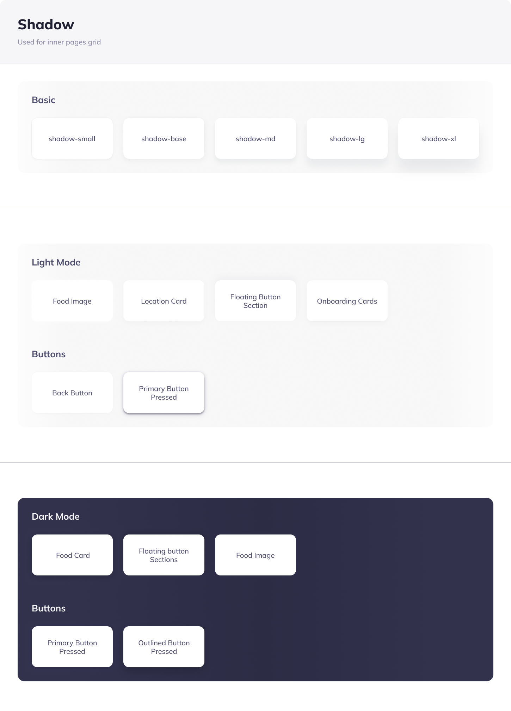
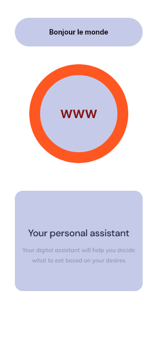

# Tutoriel QML : Comprendre les Layouts - Column, Row, et Grid

## Introduction

Dans QML, les layouts sont des composants qui organisent les éléments enfants de manière structurée et réactive. Nous allons explorer trois types de layouts : `Column`, `Row`, et `Grid`.

## 1. Column Layout

`Column` arrange ses éléments enfants verticalement.

### Exemple :


```qml
import QtQuick
import QtQuick.Controls
import QtQuick.Window
import QtQuick.Effects

ApplicationWindow {
    width: 319
    height: 690
    visible: true
    title: qsTr("Hello World")

    color: "#ffddff"
    Column {
        spacing: 10 // Espace entre les éléments
        anchors.centerIn: parent
        Rectangle {
            width: 100; height: 50; color: "red"
        }
        Rectangle {
            width: 100; height: 50; color: "green"
        }
        Rectangle {
            width: 100; height: 50; color: "blue"
        }
    }

}

```

### Explication :

- `Column` aligne tous les `Rectangle` l'un sous l'autre.
- `spacing` définit l'espace entre chaque élément.

## 2. Row Layout

`Row` arrange ses éléments enfants horizontalement.

### Exemple :


```qml
Row {
    spacing: 10 // Espace entre les éléments
    anchors.centerIn: parent


    Rectangle { width: 50; height: 100; color: "red" }
    Rectangle { width: 50; height: 100; color: "green" }
    Rectangle { width: 50; height: 100; color: "blue" }
}
```

### Explication :

- `Row` aligne tous les `Rectangle` côte à côte.
- `spacing` sert également à espacer les éléments.

## 3. Grid Layout

`Grid` arrange ses éléments enfants en grille.

### Exemple :


```qml
    Grid {
        rows: 2
        columns: 2
        spacing: 10
        
        anchors.centerIn: parent

        Rectangle { width: 100; height: 100; color: "red" }
        Rectangle { width: 100; height: 100; color: "green" }
        Rectangle { width: 100; height: 100; color: "blue" }
        Rectangle { width: 100; height: 100; color: "yellow" }
    }
```

### Explication :

- `Grid` organise les éléments dans un motif de grille avec un nombre spécifié de `rows` (lignes) et `columns` (colonnes).
- Les rectangles se placent dans la grille de gauche à droite, puis de haut en bas.

## Propriétés Communes

Ces layouts partagent certaines propriétés importantes :

- `spacing`: Définit l'espace entre les éléments enfants.
- `anchors`: Utilisé pour ancrer le layout dans son parent ou par rapport à d'autres éléments.

## Flexibilité et Réactivité

Les layouts en QML sont flexibles et réactifs. Ils s'adaptent aux modifications des tailles et des positions de leurs éléments enfants. Cette adaptabilité les rend idéaux pour créer des interfaces utilisateur dynamiques qui fonctionnent sur une variété de dispositifs et d'orientations d'écran.

## Utilisation Pratique

Utilisez `Column` pour un alignement vertical, `Row` pour un alignement horizontal, et `Grid` pour un arrangement en grille. Choisir le bon layout dépend de l'interface utilisateur que vous souhaitez créer. 

## Conclusion

Les layouts en QML, tels que `Column`, `Row`, et `Grid`, sont des outils essentiels pour organiser les éléments de l'interface utilisateur de manière structurée et réactive. Ils simplifient le processus de création de mises en page qui s'adaptent automatiquement aux changements de taille et de disposition des éléments. En pratiquant avec ces layouts, vous pouvez développer des compétences solides en design d'interface utilisateur avec QML.


# Tutoriel Avancé sur les Layouts en QML : Column, Row, et Grid

## Objectifs

Ce tutoriel vise à approfondir la compréhension des layouts `Column`, `Row`, et `Grid` en QML, et à explorer des fonctionnalités plus avancées pour créer des interfaces utilisateur dynamiques et adaptatives.

## 1. Column Layout Avancé

`Column` peut être utilisé pour des cas plus complexes avec des éléments de tailles variables et des comportements adaptatifs.

### Exemple Avancé :

```qml
Column {
    spacing: 10
    width: parent.width

    Rectangle { color: "red"; height: 50; width: parent.width * 0.5 }
    Rectangle { color: "green"; height: 50; width: parent.width * 0.75 }
    Rectangle { color: "blue"; height: 50; width: parent.width }
}
```

### Points Clés :

- Utilisation de `width: parent.width` pour que le layout s'adapte à la largeur de son conteneur.
- Les enfants ajustent leur largeur en fonction du pourcentage de la largeur du parent, permettant un comportement réactif.

## 2. Row Layout Avancé

Dans un layout `Row` avancé, vous pouvez gérer des alignements complexes et utiliser des propriétés comme `fillWidth`.

### Exemple Avancé :

```qml
Row {
    spacing: 10
    height: parent.height

    Rectangle { color: "red"; width: 100; height: parent.height * 0.5 }
    Rectangle { color: "green"; width: 100; height: parent.height * 0.75 }
    Rectangle { color: "blue"; width: 100; height: parent.height }
}
```

### Points Clés :

- Les hauteurs des éléments enfants sont ajustées en pourcentage de la hauteur du parent.
- Ce type d'arrangement est utile pour les interfaces qui doivent s'adapter verticalement.

## 3. Grid Layout Avancé

`Grid` peut être exploité pour des dispositions complexes, en ajustant dynamiquement les lignes et colonnes.

### Exemple Avancé :

```qml
Grid {
    columns: 3
    spacing: 10
    width: parent.width

    Repeater {
        model: 9
        Rectangle {
            color: modelIndex % 2 == 0 ? "lightblue" : "pink"
            width: parent.width / columns - (spacing * (columns - 1) / columns)
            height: 100
        }
    }
}
```

### Points Clés :

- `Repeater` est utilisé pour générer dynamiquement un nombre d'éléments.
- Les dimensions des éléments sont calculées en fonction du nombre de colonnes et de l'espacement.

## Astuces Avancées

- **Ancrage Dynamique :** Utilisez les propriétés d'ancrage pour ajuster dynamiquement la position des layouts en fonction des changements de l'interface utilisateur.
- **Intégration avec JavaScript :** Utilisez JavaScript pour des calculs complexes ou pour modifier dynamiquement les propriétés du layout.
- **Gestion de la Visibilité :** Changez la visibilité des éléments enfants pour créer des interfaces utilisateur dynamiques qui réagissent aux actions de l'utilisateur.

## Conclusion

En explorant les capacités avancées de `Column`, `Row`, et `Grid` en QML, vous pouvez créer des interfaces utilisateur robustes et réactives adaptées à une large gamme d'appareils et de tailles d'écran. La compréhension approfondie de ces layouts est essentielle pour tout développeur QML aspirant à créer des applications professionnelles et intuitives.


Les propriétés des layouts `Grid`, `Column`, et `Row` en QML sont essentielles pour organiser efficacement les éléments d'interface utilisateur. Voici les principales propriétés à connaître pour chacun et leurs utilités :

## Propriétés de Grid

1. **`columns` et `rows` :**
   - Définissent le nombre de colonnes et de lignes dans la grille.
   - Utiles pour structurer le contenu en grille régulière.

2. **`spacing` :**
   - Définit l'espacement uniforme entre les éléments enfants, tant horizontalement que verticalement.
   - Important pour maintenir une apparence organisée et aérée.

3. **`columnSpacing` et `rowSpacing` :**
   - Spécifient l'espacement entre les colonnes et les lignes, respectivement.
   - Permettent un contrôle plus fin sur l'espacement dans des directions spécifiques.

4. **`flow` :**
   - Détermine comment les éléments sont disposés dans la grille (de gauche à droite ou de haut en bas).
   - Utile pour la localisation et les interfaces qui doivent s'adapter à différents sens de lecture.

5. **`width` et `height` :**
   - Déterminent la largeur et la hauteur totales de la grille.
   - Essentiels pour définir la taille globale du layout.

## Propriétés de Column

1. **`spacing` :**
   - Définit l'espace vertical entre les éléments enfants.
   - Garantit que les éléments ne sont pas visuellement comprimés.

2. **`width` et `height` :**
   - Spécifient la largeur et la hauteur totales de la colonne.
   - Importantes pour contrôler la dimension globale du layout.

3. **`verticalAlignment` :**
   - Alignement vertical des éléments enfants (haut, bas, ou centre).
   - Aide à aligner les éléments de manière cohérente verticalement.

4. **`layoutDirection` :**
   - Détermine la direction de mise en page (de gauche à droite ou de droite à gauche).
   - Crucial pour les applications multilingues.

## Propriétés de Row

1. **`spacing` :**
   - Définit l'espace horizontal entre les éléments enfants.
   - Assure une séparation claire entre les éléments.

2. **`width` et `height` :**
   - Spécifient la largeur et la hauteur totales de la rangée.
   - Clés pour la dimension globale du layout.

3. **`horizontalAlignment` :**
   - Alignement horizontal des éléments enfants (gauche, droite, ou centre).
   - Important pour un alignement horizontal cohérent.

4. **`layoutDirection` :**
   - Comme dans `Column`, il détermine la direction de mise en page.
   - Important pour les interfaces adaptatives aux différentes cultures.

## Pourquoi ces Propriétés sont Importantes

Ces propriétés sont cruciales pour une conception d'interface utilisateur réussie car elles offrent un contrôle précis sur l'organisation spatiale des éléments. Elles permettent de créer des layouts réactifs qui s'adaptent à différentes tailles d'écran et orientations, tout en maintenant une apparence cohérente et esthétiquement agréable. En maîtrisant ces propriétés, vous pouvez développer des interfaces utilisateur plus intuitives et accessibles.

## Quelques exercices :

Réalisez tout ceci avec soit Column, soit Row ou Soit Grid





