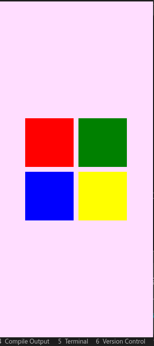

# Tutoriel QML : Comprendre les Layouts - Column, Row, et Grid

## Introduction

Dans QML, les layouts sont des composants qui organisent les éléments enfants de manière structurée et réactive. Nous allons explorer trois types de layouts : `Column`, `Row`, et `Grid`.

## 1. Column Layout

`Column` arrange ses éléments enfants verticalement.

### Exemple :


```qml
import QtQuick
import QtQuick.Controls
import QtQuick.Window
import QtQuick.Effects

ApplicationWindow {
    width: 319
    height: 690
    visible: true
    title: qsTr("Hello World")

    color: "#ffddff"
    Column {
        spacing: 10 // Espace entre les éléments
        anchors.centerIn: parent
        Rectangle {
            width: 100; height: 50; color: "red"
        }
        Rectangle {
            width: 100; height: 50; color: "green"
        }
        Rectangle {
            width: 100; height: 50; color: "blue"
        }
    }

}

```

### Explication :

- `Column` aligne tous les `Rectangle` l'un sous l'autre.
- `spacing` définit l'espace entre chaque élément.

## 2. Row Layout

`Row` arrange ses éléments enfants horizontalement.

### Exemple :


```qml
Row {
    spacing: 10 // Espace entre les éléments
    anchors.centerIn: parent


    Rectangle { width: 50; height: 100; color: "red" }
    Rectangle { width: 50; height: 100; color: "green" }
    Rectangle { width: 50; height: 100; color: "blue" }
}
```

### Explication :

- `Row` aligne tous les `Rectangle` côte à côte.
- `spacing` sert également à espacer les éléments.

## 3. Grid Layout

`Grid` arrange ses éléments enfants en grille.

### Exemple :



```qml
    Grid {
        rows: 2
        columns: 2
        spacing: 10
        
        anchors.centerIn: parent

        Rectangle { width: 100; height: 100; color: "red" }
        Rectangle { width: 100; height: 100; color: "green" }
        Rectangle { width: 100; height: 100; color: "blue" }
        Rectangle { width: 100; height: 100; color: "yellow" }
    }
```

### Explication :

- `Grid` organise les éléments dans un motif de grille avec un nombre spécifié de `rows` (lignes) et `columns` (colonnes).
- Les rectangles se placent dans la grille de gauche à droite, puis de haut en bas.

## Propriétés Communes

Ces layouts partagent certaines propriétés importantes :

- `spacing`: Définit l'espace entre les éléments enfants.
- `anchors`: Utilisé pour ancrer le layout dans son parent ou par rapport à d'autres éléments.

## Flexibilité et Réactivité

Les layouts en QML sont flexibles et réactifs. Ils s'adaptent aux modifications des tailles et des positions de leurs éléments enfants. Cette adaptabilité les rend idéaux pour créer des interfaces utilisateur dynamiques qui fonctionnent sur une variété de dispositifs et d'orientations d'écran.

## Utilisation Pratique

Utilisez `Column` pour un alignement vertical, `Row` pour un alignement horizontal, et `Grid` pour un arrangement en grille. Choisir le bon layout dépend de l'interface utilisateur que vous souhaitez créer. 

## Conclusion

Les layouts en QML, tels que `Column`, `Row`, et `Grid`, sont des outils essentiels pour organiser les éléments de l'interface utilisateur de manière structurée et réactive. Ils simplifient le processus de création de mises en page qui s'adaptent automatiquement aux changements de taille et de disposition des éléments. En pratiquant avec ces layouts, vous pouvez développer des compétences solides en design d'interface utilisateur avec QML.

# Et si on s'amusait un peu

Nous allons utiliser Grid pour placer ces images la ainsi dans la fenetre


## Cliquez Ici pour Avoir les quatres images utilisées : 

<a href=./img/img_tuto5/MTN.png>Image MTN</a>

<a href=./img/img_tuto5/MOOV.png>Image Moov</a>

<a href=./img/img_tuto5/Celtis.png>Image Celtis</a>

<a href=./img/img_tuto5/Logo.png>Image Logo</a>

### Exemple :


```qml
    Grid {
        rows: 2
        columns: 2
        spacing: 10
        
        anchors.centerIn: parent

        Rectangle { width: 100; height: 100; color: "red" }
        Rectangle { width: 100; height: 100; color: "green" }
        Rectangle { width: 100; height: 100; color: "blue" }
        Rectangle { width: 100; height: 100; color: "yellow" }
    }
```