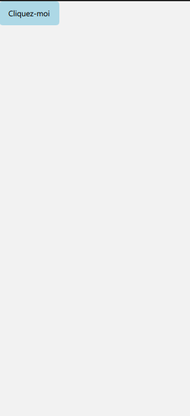
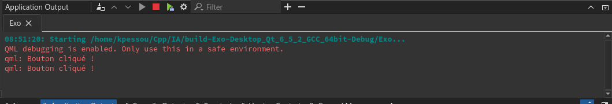
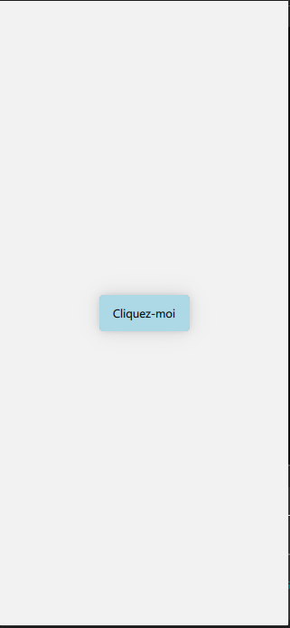
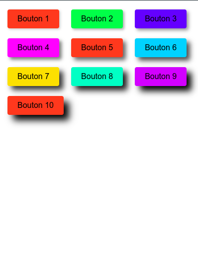
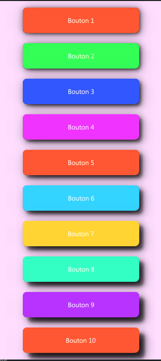

# Tutoriel QML : Gestion des Événements de Clic sur des Boutons Rectangulaires

## Introduction

Dans ce tutoriel, vous allez apprendre à gérer les événements de clic sur des boutons en QML. Nous utiliserons des `Rectangle` pour créer des boutons personnalisés et interagir avec eux.

## Création de Base d'un Bouton

Commençons par créer un bouton de base en utilisant `Rectangle` :




```qml
import QtQuick

Rectangle {
    id: button
    width: 100
    height: 40
    color: "lightblue"
    radius: 5

    Text {
        text: "Cliquez-moi"
        anchors.centerIn: parent
    }

    MouseArea {
        anchors.fill: parent
        onClicked: {
            console.log("Bouton cliqué !")
        }
    }
}
```


Dans cet exemple, le `Rectangle` agit comme un bouton. Le `MouseArea` est utilisé pour détecter les clics. Lorsque le bouton est cliqué, un message est affiché dans la console.



> Petit exercice: essayer de centrer le rectangle dans la fenettre

## Ajout d'Effets Visuels au Clic

Il est courant de donner un retour visuel quand l'utilisateur interagit avec un bouton. Modifions la couleur du bouton lorsqu'il est pressé.

```qml
MouseArea {
    anchors.fill: parent
    onClicked: {
        button.color = "lightgreen"
    }
    onPressed: {
        button.color = "darkblue"
    }
    onReleased: {
        button.color = "lightblue"
    }
}
```

> Petit exercice: essayer d'ajouter de l'ombrage au bouton




```qml
import QtQuick
import QtQuick.Controls
import QtQuick.Window
import QtQuick.Effects

ApplicationWindow {
    width: 319
    height: 690
    visible: true
    title: qsTr("Hello World")

    Rectangle {
        id: button
        width: 100
        height: 40
        color: "lightblue"
        radius: 5
        anchors.centerIn: parent

        Text {
            text: "Cliquez-moi"
            anchors.centerIn: parent
        }

        MouseArea {
            anchors.fill: parent
            onClicked: {
                button.color = "lightgreen"
            }
            onPressed: {
                button.color = "darkblue"
            }
            onReleased: {
                button.color = "lightblue"
            }
        }
    }


    MultiEffect {
        source: button
        anchors.fill: button

        shadowColor: "#0C1A4B"
        shadowOpacity: 0.24
        shadowBlur: 1
        shadowEnabled: true
        shadowVerticalOffset: 0
        shadowHorizontalOffset: 0
    }
}

```

Ici, `onPressed` et `onReleased` sont utilisés pour changer la couleur du bouton lors de la pression et de la libération du bouton.

## Gestion de Plusieurs Boutons

Pour gérer plusieurs boutons, vous pouvez utiliser une fonction avec un paramètre pour identifier le bouton cliqué.

```qml
function buttonClicked(buttonId) {
    console.log("Bouton " + buttonId + " cliqué !")
}

Rectangle {
    id: button1
    // Propriétés du bouton...
    MouseArea {
        anchors.fill: parent
        onClicked: buttonClicked("1")
    }
}

Rectangle {
    id: button2
    // Propriétés du bouton...
    MouseArea {
        anchors.fill: parent
        onClicked: buttonClicked("2")
    }
}
```

Dans ce cas, chaque bouton appelle `buttonClicked` avec un identifiant unique.

## Conclusion

Avec ces techniques, vous pouvez créer des boutons interactifs en QML en utilisant des rectangles et gérer leurs événements de clic de manière efficace. Vous pouvez étendre ces concepts pour inclure d'autres types d'interactions, comme le survol ou les événements de double-clic.

## Exercices à faire






```qml
import QtQuick
import QtQuick.Controls
import QtQuick.Window
import QtQuick.Effects

ApplicationWindow {
    width: 319
    height: 690
    visible: true
    title: qsTr("Hello World")

    color: "#ffddff"
    
    Column {
        spacing: 10
        anchors.centerIn: parent

        Repeater {
            model: 10

            Item {
                id: buttonContainer
                width: 300
                height: 56

                Rectangle {
                    id: button
                    width: 230
                    height: 48
                    color: getColor(index)
                    radius: 8
                    anchors.centerIn: parent

                    Text {
                        text: "Bouton " + (index + 1)
                        anchors.centerIn: parent
                        color: "white"
                    }

                    MouseArea {
                        anchors.fill: parent
                        onClicked: console.log("Bouton " + (index + 1) + " cliqué !")
                    }
                }

                MultiEffect {
                    source: button
                    anchors.fill: button

                    property real shadowSize: index * 1.0 + 2.0

                    shadowColor: "#000000"
                    shadowBlur: 1
                    shadowOpacity: getOpacity(index)
                    shadowVerticalOffset: index + 2
                    shadowHorizontalOffset: index + 2
                    shadowEnabled: true
                }
            }
        }
    }

    function getColor(index) {
        var colors = ["#FF5733", "#33FF57", "#3357FF", "#F033FF", "#FF5733",
                      "#33D4FF", "#FFD433", "#33FFC5", "#B833FF", "#FF5733"];
        return colors[index % colors.length];
    }

    function getOpacity(index) {
        var opacities = [0.5, 0.6, 0.7, 0.8, 0.9, 0.95, 0.95, 1, 1, 1];
        return opacities[index % opacities.length];
    }

}

```

Ce code en QML crée une interface utilisateur contenant une liste de boutons, chacun avec son propre style et effet d'ombre. Voici une explication détaillée adaptée aux débutants :

## Structure du Code

### Importations

```qml
import QtQuick
import QtQuick.Controls
import QtQuick.Window
import QtQuick.Effects
```

Ces lignes importent les modules nécessaires pour utiliser divers éléments QML, comme `Rectangle`, `Text`, et `MouseArea`, ainsi que pour appliquer des effets visuels comme `MultiEffect`.

### ApplicationWindow

```qml
ApplicationWindow {
    width: 319
    height: 690
    visible: true
    title: qsTr("Hello World")
    color: "#ffddff"
    ...
}
```

`ApplicationWindow` est l'élément racine de votre application. Il définit la taille, la visibilité, le titre et la couleur de fond de la fenêtre principale.

### Column

```qml
Column {
    spacing: 10
    anchors.centerIn: parent
    ...
}
```

`Column` est utilisé pour organiser les éléments (ici, les boutons) verticalement. `spacing: 10` ajoute un espace de 10 pixels entre chaque élément enfant. `anchors.centerIn: parent` centre la colonne dans la fenêtre.

### Repeater

```qml
Repeater {
    model: 10
    ...
}
```

`Repeater` est un élément qui crée un nombre spécifié d'éléments enfants. `model: 10` signifie qu'il va répéter son contenu enfant dix fois.

### Item (Conteneur de Bouton)

```qml
Item {
    id: buttonContainer
    width: 300
    height: 56
    ...
}
```

Chaque `Item` agit comme un conteneur pour un bouton. Il définit la largeur et la hauteur du bouton.

### Rectangle (Bouton)

```qml
Rectangle {
    id: button
    width: 230
    height: 48
    color: getColor(index)
    radius: 8
    anchors.centerIn: parent
    ...
}
```

`Rectangle` crée le bouton. `getColor(index)` donne à chaque bouton une couleur différente en fonction de son index dans la liste. `radius: 8` arrondit les coins. `anchors.centerIn: parent` centre le bouton dans son conteneur `Item`.

### Text

```qml
Text {
    text: "Bouton " + (index + 1)
    anchors.centerIn: parent
    color: "white"
}
```

`Text` affiche un label sur le bouton. Il est centré dans le bouton et a une couleur blanche.

### MouseArea

```qml
MouseArea {
    anchors.fill: parent
    onClicked: console.log("Bouton " + (index + 1) + " cliqué !")
}
```

`MouseArea` détecte les interactions de la souris avec le bouton. Lorsque le bouton est cliqué, il affiche un message dans la console.

### MultiEffect (Ombre)

```qml
MultiEffect {
    source: button
    anchors.fill: button
    ...
}
```

`MultiEffect` applique un effet d'ombre au bouton. Les propriétés comme `shadowColor`, `shadowBlur`, `shadowOpacity`, `shadowVerticalOffset`, et `shadowHorizontalOffset` sont utilisées pour créer l'effet d'ombre.

### Fonctions Auxiliaires

```qml
function getColor(index) { ... }
function getOpacity(index) { ... }
```

Ces fonctions sont utilisées pour obtenir la couleur et l'opacité des ombres en fonction de l'index du bouton.

## Explications des Concepts

### Modèle de Répétition avec Repeater

`Repeater` est une manière puissante de créer des interfaces répétitives. Il prend un élément enfant et le clone plusieurs fois en fonction de son modèle (`model`).

### Gestion des Événements

`MouseArea` est utilisé pour gérer les interactions utilisateur comme les clics. C'est un moyen courant de rendre les éléments interactifs en QML.

### Effets Visuels avec MultiEffect

`MultiEffect` permet d'ajouter des effets complexes, comme des ombres, sans avoir besoin de manipuler directement les pixels ou les images.
