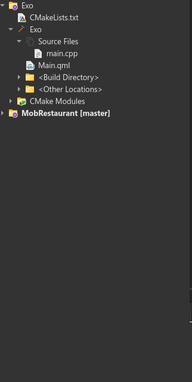
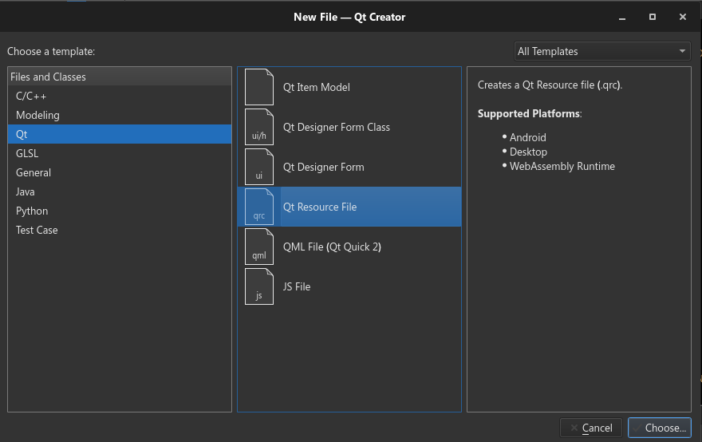

# Tutoriel Complet sur les Images en QML

## Introduction

Les images sont des éléments essentiels dans la conception d'interfaces utilisateur en QML. Ce tutoriel couvre tout, des bases de l'affichage des images aux fonctionnalités avancées pour manipuler et interagir avec elles.

## Inserer une image dans le projet
Voici comment nous ferons à chaque fois que nous voulons ajouter des images à notre projet.

* Dans le dossier de l'application là où se trouve le **main.cpp**, **Main.qml**, ..., depuis l'explorateur de fichier, créer un dossier nommé : (le nom du dossier de toutes vos images) **Images**. 
C'est aini que je fais toujours. C'est dans ce dossier que vous mettrez toutes vos images, vous pouvez même créér à l'intérieur des sous-dossiers et bien ranger et hieérachiser vos images
* Rendez-vous dans le **CMakeLists.txt**
* Localiser la ligne **qt_add_executable**
* Juste au dessus de cette ligne, placer : 

    file(GLOB_RECURSE IMAGES_SOURCES RELATIVE ${CMAKE_CURRENT_SOURCE_DIR} ${CMAKE_CURRENT_SOURCE_DIR}/Images/* . *)
> Il n'y a pas d'espace dans la partie /* . * , je dis bien aucun espace

> Il n'y a pas d'espace dans la partie /* . * , je dis bien aucun espace

> Il n'y a pas d'espace dans la partie /* . * , je dis bien aucun espace

* Dans la parenthèse de **qt_add_executable** ajouter ceci 

    ${IMAGES_SOURCES}

* Localiser la ligne **qt_add_qml_module** et ajouter ceci : 

    RESOURCES
        ${IMAGES_SOURCES}
* Faites un click droit sur le nom du projets au niveau des fichiers, là où il y a un marteau



* Ajouter nouveau
* Vous sélectionner Qt 


* Vous choisissez, vous donnez un nom, vous finnisez
* Chez moi j'ai nommé ça Images
* Donc vous verrez un Images.qrc dans le projet (en tout cas selon le nom que vous avez decidé)
* Completer ceci dans **qt_add_qml_module**

    RESOURCES
        Images.qrc
* Click droit sur Images.qrc, Click sur Ajouter un prefix, et ajouter ceci au niveau de prefix : */*
* CLick droit sur **Images.qrc**, appuiyer sur ouvrir dans l'éditeur.
* Une fois dedans, appuiyer sur ajouter des fichier et ajoutez-y toutes ovos images depuis le dossier Images

C'est parfait on a fini.


## Afficher une Image de Base

### Element `Image`

L'élément `Image` en QML est utilisé pour afficher des images.

#### Exemple Basique :

```qml
import QtQuick

Image {
    source: "chemin/vers/image.png"
}
```

### Propriétés Clés :

- `source`: Chemin du fichier image.
- `width`, `height`: Dimensions de l'image.

## Contrôle des Dimensions

### Redimensionnement

Vous pouvez contrôler la taille de l'image avec `width` et `height`.

#### Exemple :

```qml
Image {
    source: "chemin/vers/image.png"
    width: 200
    height: 150
}
```

Pour connaitre le chemin vers votre image, vous cliquer sur **Images.qrc**, vous identifier votre image, vous faites click droit dessus, et vous appuiyez sur copier l'**URL** de l'image.

### Exemple dans mon cas : 

```qml
Image {
        source: "qrc:/Images/monImage.png"
        width: 200
        height: 150
    }
```

### Maintien du Rapport Hauteur/Largeur

Pour conserver le rapport hauteur/largeur de l'image :

#### Exemple :

```qml
Image {
    source: "chemin/vers/image.png"
    fillMode: Image.PreserveAspectFit
}
```

### `fillMode`

`fillMode` contrôle comment l'image s'adapte à la taille assignée :

- `Image.Stretch`: Étire l'image pour remplir l'espace.
- `Image.PreserveAspectFit`: Conserve le rapport hauteur/largeur en ajustant l'image dans l'espace.
- `Image.PreserveAspectCrop`: Conserve le rapport et recadre ce qui dépasse.

## Manipulation de l'Image

### Rotation et Echelle

Vous pouvez transformer l'image avec `rotation` et `scale`.

#### Exemple :

```qml
Image {
    source: "chemin/vers/image.png"
    rotation: 45 // Rotation de 45 degrés
    scale: 1.5 // Agrandissement de 50%
}
```

### Opacité et Couleur

Modifier l'opacité et appliquer une couleur de teinte :

#### Exemple :

```qml
Image {
    source: "chemin/vers/image.png"
    opacity: 0.5 // Semi-transparent
    color: "#ff0000" // Teinte rouge
}
```

## Interaction avec l'Image

### Cliquer sur une Image

Utilisez `MouseArea` pour détecter les clics sur l'image.

#### Exemple :

```qml
Image {
    source: "chemin/vers/image.png"
    MouseArea {
        anchors.fill: parent
        onClicked: {
            console.log("Image cliquée")
        }
    }
}
```

## Utilisation d'Images dans des Éléments Plus Complexes

### Images en tant qu'Icônes dans des Boutons

Créer des boutons avec des icônes :

#### Exemple :

```qml
Button {
    text: "Cliquez-moi"
    icon.source: "chemin/vers/icon.png"
}
```

## Chargement et Performance

### Gestion du Chargement Asynchrone

Pour les images volumineuses, utilisez le chargement asynchrone :

#### Exemple :

```qml
Image {
    source: "chemin/vers/large-image.png"
    asynchronous: true
}
```

### Images en Cache

QML met en cache les images chargées, ce qui améliore les performances pour les images réutilisées.

## Conclusion

Les images en QML offrent une grande flexibilité et sont essentielles pour créer des interfaces utilisateur riches et interactives. En maîtrisant ces fonctionnalités, vous pouvez améliorer l'esthétique, la convivialité et les performances de vos applications QML. Les possibilités sont vastes, des simples affichages d'image aux interfaces utilisateur complexes avec des images interactives et animées.